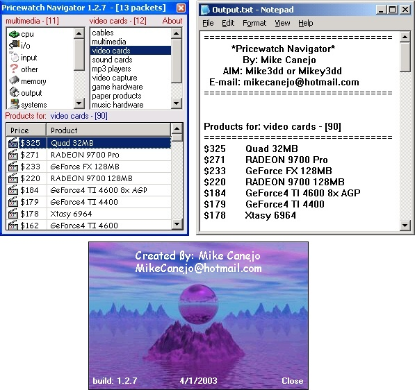



## Pricewatch Navigator

### Description

This program gets the cheapest to most expensive prices on all computer related hardware/software and displays it in a simple organized listview where it can be sorted in various ways. This list of products can then output to an organized regular text file for which ever reason you may have for it. Products can also be double clicked in the listview to go directly to pricewatch.com for a list of manufacturers for that particular item. Since I buy hardware/software on a regular basis, this program has helped make the whole process alot easier. I added a seperate project that will add a XP dialog gui to your forms on the fly as well. Enjoy.
 
### More Info
 

             |
---                |---
**Submitted On**   |2003-04-13 15:09:26
**By**             |[Michael L\. Canejo](https://github.com/Planet-Source-Code/PSCIndex/blob/master/ByAuthor/michael-l-canejo.md)
**Level**          |Intermediate
**User Rating**    |4.9 (93 globes from 19 users)
**Compatibility**  |VB 4\.0 \(16\-bit\), VB 4\.0 \(32\-bit\), VB 5\.0, VB 6\.0
**Category**       |[Complete Applications](https://github.com/Planet-Source-Code/PSCIndex/blob/master/ByCategory/complete-applications__1-27.md)
**World**          |[Visual Basic](https://github.com/Planet-Source-Code/PSCIndex/blob/master/ByWorld/visual-basic.md)
**Archive File**   |[Pricewatch1577884222003\.zip](https://github.com/Planet-Source-Code/michael-l-canejo-pricewatch-navigator__1-44416/archive/master.zip)

